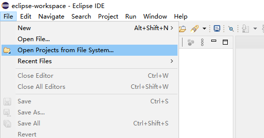
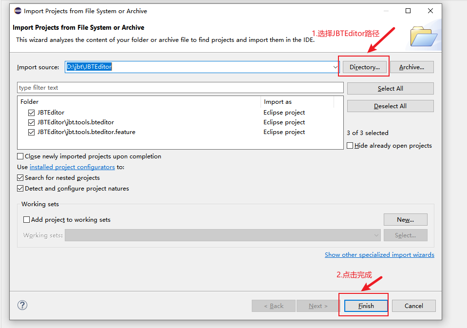
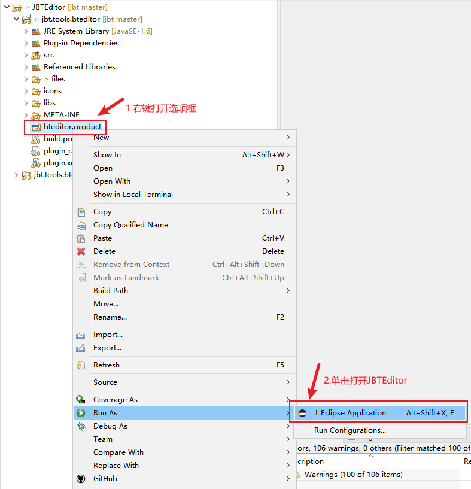
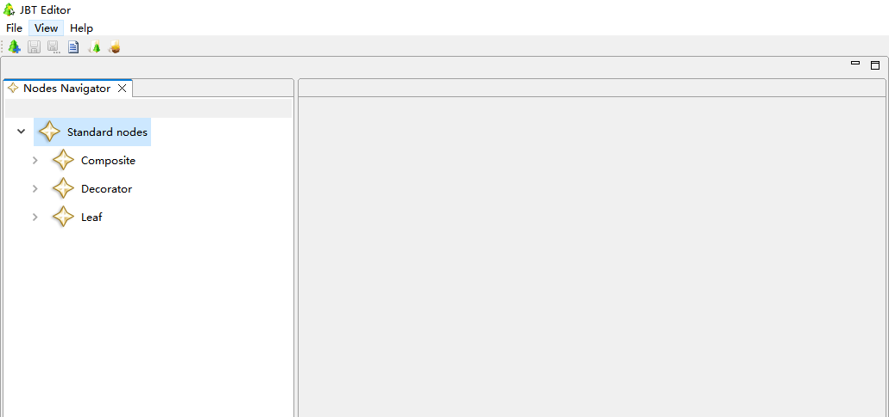
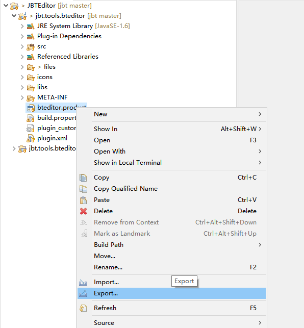
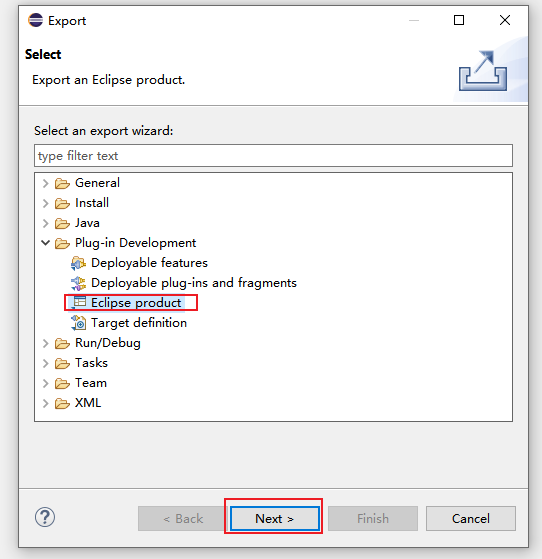
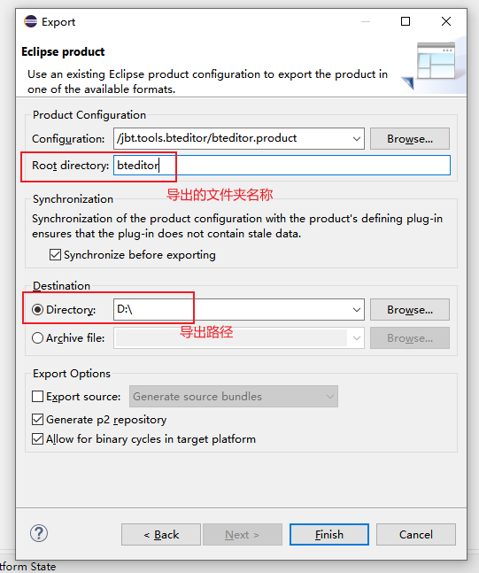
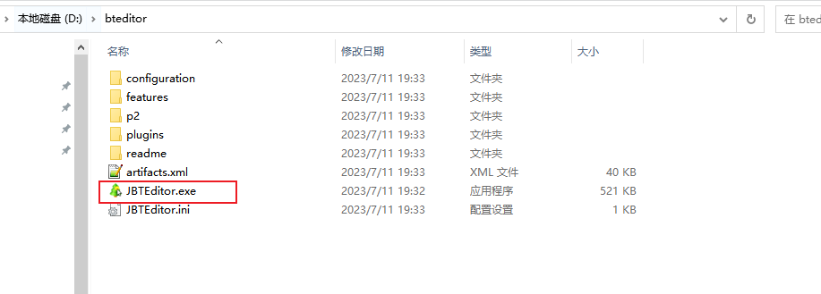
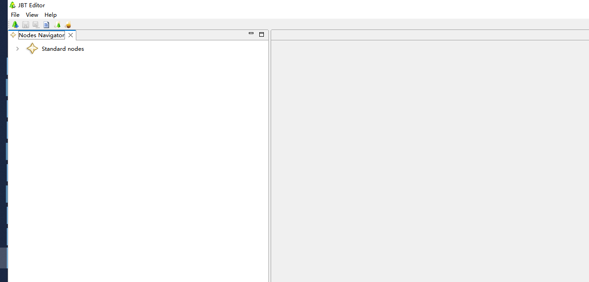
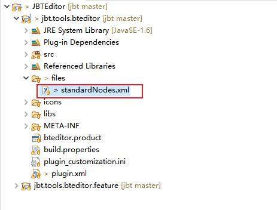

# JBTEditor教程

## 导入并启动JBTEditor

### 环境准备

JBTEditor是基于Eclipse RCP开发的。需要eclipse rpc版本IDE才能运行。

因此，需要先自行从官网下载IDE。

### 导入JBTEditor

1. 点击左上方File -> Open Projects from File System

2.点击之后，会弹出下面弹窗。

选择JBTEditor项目路径后，点击Finish按钮完成项目导入。

### 启动JBTEditor

1.右键点击bteditor.product -> Run As -> Eclipse Application

2.JBTEditor界面

到此，JBTEditor启动完成。

## 导出JBTEditor可执行文件

JBTEditor最终要交给策划使用的，为此需要导出可执行文件给他们使用。

1. 右键点击bteditor.product -> Export

2.选择Eclipse product -> next

3.调整导出文件夹名称和导出路径 -> Finish

4.静待导出后，会获得一个zip包。

解压缩后，进入文件夹，双击JBTEditor.exe文件

5.最终打开JBTEditor

## 扩展编辑器节点

编辑器默认自带的组合节点、装饰节点可能没办法满足项目的全部需求。

因此，项目组一般会对行为树做扩展，增加一些新的节点。

那么，会希望编辑器也可以带上这些扩展的节点。

通过对standardNodes.xml进行编辑，即可实现编辑器节点的扩展。

又或者可以编辑导出的bteditor中的配置文件。

路径如下：

D:\bteditor\configuration\org.eclipse.osgi\8\0\.cp\files\standardNodes.xml

